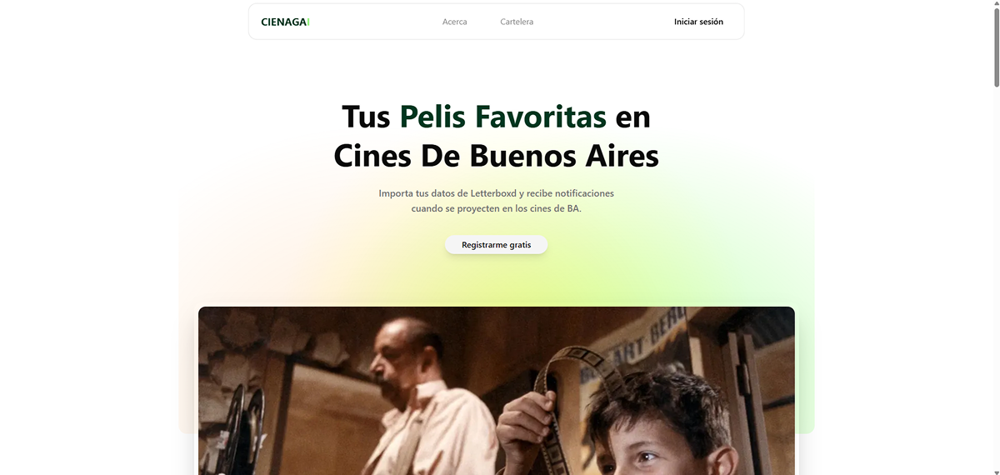

<p align="center">

</p>

<h1 align="center">🌊 Ciénaga</h1>

<p align="center">Aplicación web que te avisa cuando en los cines de Buenos Aires se proyectan películas de directores que te gustan.</p>

---

## 🚀 Características principales

- **Importar tu historial de Letterboxd** (`watched.csv` y `ratings.csv`).
- A partir de las URLs de las películas, el sistema obtiene automáticamente los directores.
- Guarda tus directores favoritos en la base de datos.
- Scrapea periódicamente la cartelera de distintos cines porteños (Gaumont, Cosmos, Malba, Sala Lugones, Cine York, etc).
- Hace un _match_ entre tus directores favoritos y la programación.
- Te notifica por **mail** cuando hay una peli de un director que te interesa.
- Si no estás logueado, la app igual muestra una selección de películas destacadas o recomendadas.

---

## 🏗️ Tecnologías

- Next.js, shadcn - Supabase (Postgres + Auth + Storage) - GitHub Actions + Cheerio + Resend

---

## 🔄 Cómo funciona

1. El usuario sube su CSV exportado desde Letterboxd.
2. Se guardan las URLs de películas en Supabase.
3. Un cron job (GitHub Actions) se ejecuta cada 12h:
   - Scrapea esas URLs y obtiene los directores.
   - Scrapea carteleras de cines y actualiza screenings en la DB.
4. La app cruza tus directores favoritos con la cartelera.
5. Te avisa por mail y muestra la info en tu dashboard.

---

## 📂 Estructura de datos (Supabase)

| Tabla              | Contenido                          |
| ------------------ | ---------------------------------- |
| **users**          | info de usuario + login con Google |
| **directors**      | nombre único de cada director      |
| **user_directors** | relación entre usuario y director  |
| **movies**         | título, año, URL, `director_id`    |
| **screenings**     | fecha, hora, cine, `movie_id`      |
| **cinemas**        | nombre + URL de scraper            |

---

## ⚙️ Instalación y setup

```bash
git clone https://github.com/brandonporcel/cienaga.git
cd cienaga
pnpm install
pnpm dev
```

### Configurar variables de entorno en .env.local:

```bash
NEXT_PUBLIC_SUPABASE_URL=...
NEXT_PUBLIC_SUPABASE_ANON_KEY=...
```

> 💡 Nota: Quien clone el proyecto debe crear un proyecto en Supabase y crear las tablas manualmente.

## ✅ To-Do

1. Autenticación

- [ ] Implementar login/signup con mail. [guia next](https://nextjs.org/docs/app/guides/authentication)

2. Dashboard + CSV

- [ ] Subida/Importación de watched.csv / ratings.csv.
- [ ] Parseo del CSV en frontend o backend.
- [ ] Guardar en Supabase:
  - [ ] Películas (movies).
  - [ ] Directores (directors).
  - [ ] Relación user ↔ director (user_directors).
- [ ] Mostrar historial de uploads en el dashboard.
- [ ] Dashboard con coincidencias
- [ ] Recomendaciones basadas en ratings

3. Cartelera / Scraping

- [ ] Setear GitHub Actions con un script Node + Cheerio.
- [ ] Scrapear cines básicos (Gaumont, Cosmos, Lugones).
- [ ] Guardar screenings en screenings.
- [ ] Endpoint/API en Supabase (o Edge Function) para exponer la cartelera.

4. Recordatorio

- [ ] Notificaciones por mail

5. Más

- [ ] Integracion con QRs
  - [ ] QR en cada función: “Escaneá y agregala a tu calendario” o “Abrir en la web del cine”.
- [ ] Integración con lambda
- [ ] Integración con Google Calendar
  - [ ] En mail agregar widget para agregar a calendario

## 🎬 Páginas/cines:

1. malba (quizas no hace falta porque tiene un newsletter que avisa mensualmente programacion): https://www.malba.org.ar/eventos/de/actividades-cine/
2. Sala Lugones: https://complejoteatral.gob.ar/cine
3. Cine york: https://www.vicentelopez.gov.ar/agenda/agenda-lumiton
4. CCK: https://palaciolibertad.gob.ar/cine/
5. gaumont: https://www.cinegaumont.ar/ / https://letterboxd.com/franco2601/list/cine-gaumont-cartelera/
6. cine lorca: https://cinelorca.wixsite.com/cine-lorca/current-production - https://www.lanacion.com.ar/cartelera-de-cine/sala/lorca-sa110
7. cine cosmos: https://www.cinecosmos.uba.ar/
8. Teatro Municipal Gregorio de Laferrere: https://ellaferrere.com.ar/programacion/
9. CC San Martín
10. Bafici
11. Hoyts
12. Web cartelera Sigilio

---

## Contribuciones

Las contribuciones son siempre bienvenidas. No dudes en abrir un pr/issue.

## Feedback

Me encantaría conocer tu opinión. Contactame por [mail](brandon7.7porcel@gmail.com) o [linkedin](https://www.linkedin.com/in/brandonporcel/)

<!--
utils
- https://gasti.pro/en/
- https://v0.app/chat/pointer-ai-landing-page-b3xq2HC1JCs
- https://www.miscuentas.com.ar/dashboard
- https://ui.shadcn.com/blocks: A dashboard with sidebar, charts and data table
- https://youtu.be/XgqCh2FwNVY: 2. How to add Google OAuth in Nextjs with Supabase | Server Component | Server Action | Google Login
 -->
