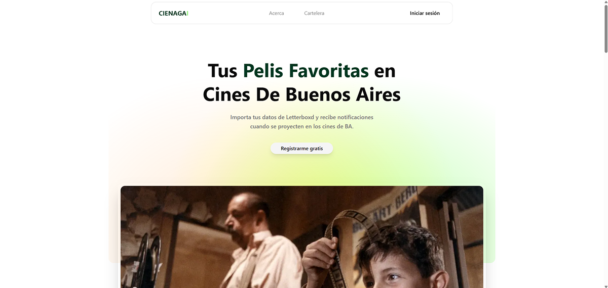

<p align="center">

</p>

<h1 align="center">🌊 Ciénaga</h1>

<p align="center">Aplicación web que te avisa cuando en los cines de Buenos Aires se proyectan películas de directores que te gustan.</p>

<p align="center">
  <a href="#-características-principales">Características</a> •
  <a href="#-cómo-funciona">Cómo funciona</a> •
  <a href="#-instalación">Instalación</a> •
  <a href="#-api-endpoints">API</a> •
  <a href="#-arquitectura">Arquitectura</a>
</p>

---

## 🚀 Características principales

- **Importar historial de Letterboxd**: Sube tus archivos `watched.csv` y `ratings.csv`
- **Extracción automática de directores**: Sistema de scraping que obtiene directores, posters, y metadatos desde Letterboxd
- **Scraping de carteleras**: Monitoreo automático de cines porteños con datos detallados (horarios, salas, precios)
- **Lista de funciones**: Scraping semanal de la [lista de Letterboxd](https://letterboxd.com/lamateroric/list/funciones-en-buenos-aires/) con cines nuevos descubiertos automáticamente
- **Seguimiento inteligente**: Automáticamente identifica directores favoritos basado en tu historial
- **Notificaciones personalizadas**: Te avisa por email cuando hay películas de directores que seguís
- **Dashboard rico**: Muestra coincidencias con información completa de eventos
- **Cartelera pública**: Mejores películas en cartelera sin necesidad de registro

---

## 🔄 Cómo funciona

### 1. **Importación y procesamiento**

- Subís tu CSV exportado de Letterboxd
- Se crean automáticamente las relaciones usuario-película-director
- Sistema inteligente evita duplicados y mantiene consistencia

### 2. **Scraping automatizado** (GitHub Actions)

- **Directores y metadatos**: Extrae información completa desde Letterboxd (directors, posters, ratings)
- **Carteleras detalladas**: Procesa eventos de cada cine con fechas, horarios, salas y descripciones
- **Sincronización**: Mantiene actualizada la relación usuario-directores automáticamente

### 3. **Matching y experiencia personalizada**

- Cruza tus directores favoritos con la programación actual
- Dashboard con filtros avanzados (fecha, cine, rating, horarios)
- Notificaciones por email de coincidencias relevantes

---

## 📂 Arquitectura de datos

### Base de datos (Supabase)

| Tabla            | Descripción                         | Campos clave                                                    |
| ---------------- | ----------------------------------- | --------------------------------------------------------------- |
| `users`          | Información de usuarios             | `id`, `email`, `has_upload_csv`                                 |
| `movies`         | Películas con metadatos completos   | `title`, `year`, `rating`, `director_id`, `poster_url`          |
| `directors`      | Directores con URLs de Letterboxd   | `name`, `url`, `image_url`                                      |
| `user_movies`    | Películas de usuarios con ratings   | `user_id`, `movie_id`, `rating`                                 |
| `user_directors` | Directores seguidos (auto-generado) | `user_id`, `director_id`                                        |
| `cinemas`        | Cines monitoreados                  | `name`, `url`                                                   |
| `screenings`     | Eventos con detalles completos      | `movie_id`, `cinema_id`, `screening_time`, `event_type`, `room` |

### Scripts automatizados

```
scripts/
├── scrape-directors.ts           # Scraping de perfiles de directores (avatar, bio, tmdb_id)
├── scrape-movie-data.ts          # Scraping de películas (asigna directores y metadatos)
├── scrape-screenings.ts          # Orchestrator de carteleras
├── scrape-list.ts                # Scraping de lista Letterboxd (funciones en Buenos Aires)
├── send-notifications.ts         # Envío de notificaciones por email
└── services/
    ├── movie-data/               # Pipeline películas → directores
    │   ├── api.director.service.ts
    │   ├── batch-processor.service.ts
    │   └── letterboxd-scraper.service.ts
    ├── list/                     # Parser de notas de la lista Letterboxd
    │   └── list-note-parser.ts
    ├── notifications/            # Agrupación y envío de emails
    │   ├── email.service.ts
    │   ├── notification.service.ts
    │   └── template.builder.ts
    └── screenings/               # Scrapers específicos por cine
        ├── base-scraper.service.ts
        ├── malba.scraper.ts
        ├── lumiton.scraper.ts
        └── scraper.factory.ts    # Mapea slug del cine → scraper
```

---

## ⚙️ Instalación

### Prerrequisitos

- Node.js 24+
- pnpm
- Cuenta de Supabase
- Cuenta de GitHub (para Actions)

### Setup local

```bash
git clone https://github.com/brandonporcel/cienaga.git
cd cienaga
pnpm install
```

### Variables de entorno

Crear `.env.local`:

```bash
NEXT_PUBLIC_SUPABASE_URL=tu_supabase_url
NEXT_PUBLIC_SUPABASE_ANON_KEY=tu_anon_key
SUPABASE_SERVICE_ROLE_KEY=tu_service_role_key

CRON_SECRET_KEY=tu_clave_secreta_para_cron

RESEND_API_KEY=tu_resend_key
```

### Base de datos

```bash
# Importar schema y datos iniciales
psql -f db/schema.sql
psql -f db/seed.sql
```

### GitHub Actions

1. Ir a Settings → Secrets and variables → Actions
2. Agregar secrets:
   - `APP_URL`: URL de tu app desplegada
   - `CRON_SECRET_KEY`: Misma clave del .env

### Desarrollo

```bash
pnpm dev                          # Servidor de desarrollo
pnpm scrape:director-profiles     # Probar scraping de perfiles
pnpm scrape:letterboxd-list       # Probar scraping de lista Letterboxd
pnpm type-check                   # Verificar TypeScript
```

---

## 🌐 API Endpoints

### Scraping automatizado (protegidos con `Authorization: Bearer <CRON_SECRET_KEY>`)

```
GET  /api/movies/pending           # Películas sin director ni poster
GET  /api/movies/count-pending     # Verificar si hay trabajo pendiente
POST /api/movies/batch             # Asignar directores y metadatos
GET  /api/directors/pending        # Directores sin tmdb_id
POST /api/directors/batch-update   # Actualizar perfiles de directores
POST /api/screenings/batch         # Guardar eventos de cines en lote
POST /api/list/batch                # Guardar funciones desde lista Letterboxd
POST /api/users/bulk               # Emails de usuarios por ids
POST /api/notifications/log        # Registrar envíos de notificaciones
```

### Públicos

```
GET  /api/cinemas                  # Cines monitoreados (?enabled=true)
GET  /api/screenings/featured      # Funciones para la home
```

### Server actions (sesión del usuario)

- `saveMoviesAction` — importación de CSVs de Letterboxd
- `getPersonalizedScreenings` — dashboard personalizado

**Validaciones**: Los endpoints usan Zod para validación robusta de datos

---

## 🎬 Cines monitoreados

| Cine                    | URL                                                            | Estado         |
| ----------------------- | -------------------------------------------------------------- | -------------- |
| **Malba**               | https://malba.org.ar/cine/                                     | ✅             |
| **Cine York (Lumiton)** | https://lumiton.ar/                                            | ✅             |
| **Sala Lugones**        | https://complejoteatral.gob.ar/cine                            | 🔄 Sin scraper |
| **CCK**                 | https://palaciolibertad.gob.ar/cine/                           | 🔄 Sin scraper |
| **Gaumont**             | https://www.cinegaumont.ar/                                    | 🔄 Sin scraper |
| **Cine Lorca**          | https://www.lanacion.com.ar/cartelera-de-cine/sala/lorca-sa110 | 🔄 Sin scraper |
| **Cine Cosmos**         | https://www.cinecosmos.uba.ar/                                 | 🔄 Sin scraper |

Los cines sin scraper están deshabilitados en `db/seed.sql` (`enabled = false`) para que el workflow de carteleras no falle.

Además, la **lista de funciones** descubre cines nuevos automáticamente (Cine Lorca, MALBA, CCK, Cine Arte Cacodelphia, Centro Cultural Recoleta, etc.). Se crean con `enabled = false` en la DB — la lista es la fuente de datos para estos cines.

---

## 🏗️ Stack

- Next.js - Supabase (PostgreSQL, Auth, Storage) - GitHub Actions - Resend

---

## 📋 To-Do

- [ ] Integración con Google Calendar
- [ ] Códigos QR para funciones
- [ ] Usar funciones lambda
- [ ] Docker
- [ ] Terminar scrapers de cines
- [ ] Tests
- [ ] Agregar personalizacion para banda temporal para recibir de notificaciones. Screenings dentro de las proximos x horas/dias.
- [ ] En vez de scrapear obtener datos de json. https://letterboxd.com/film/when-evil-lurks/json/

---

## 🤝 Contribuir

Si tienes ideas o mejoras, no dudes en hacer un fork del proyecto y enviar un pull request.

---

## 📞 Feedback

Me encantaría conocer tu opinión sobre el proyecto. Puedes enviarme un [email](https://mail.google.com/mail/?view=cm&fs=1&to=brandon7.7porcel@gmail.com&su=Cienaga) o a través de [LinkedIn](https://www.linkedin.com/in/brandonporcel/).
